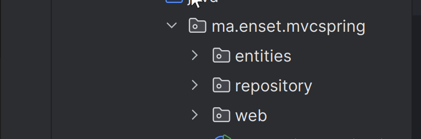
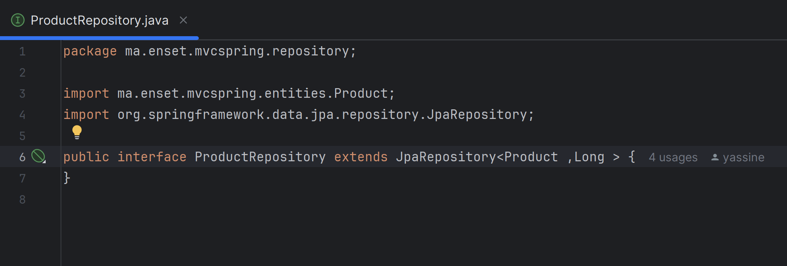
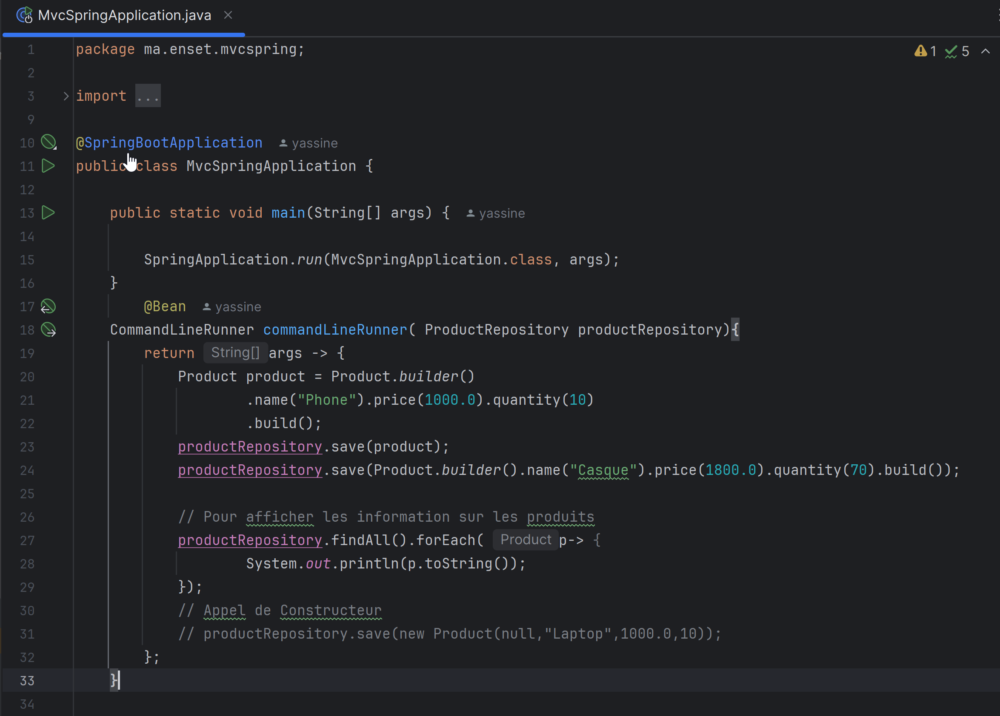
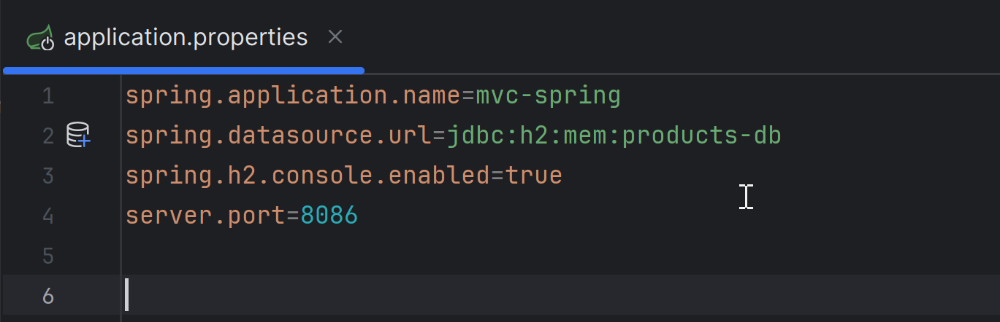
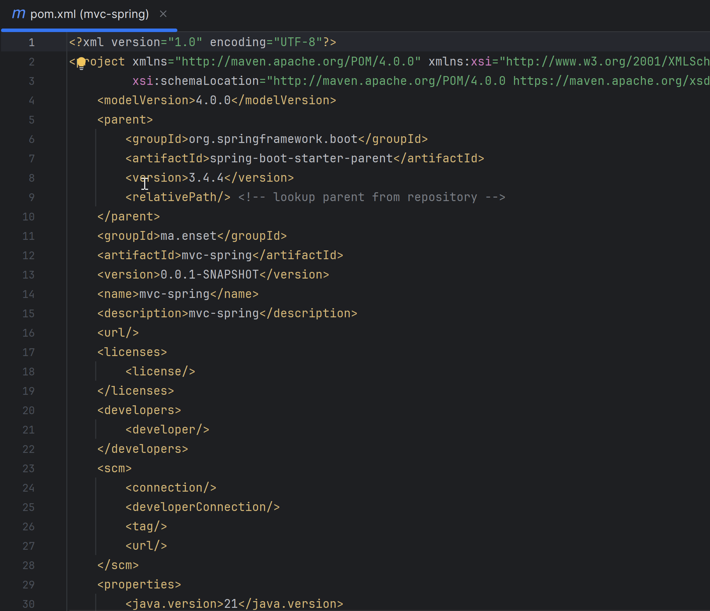
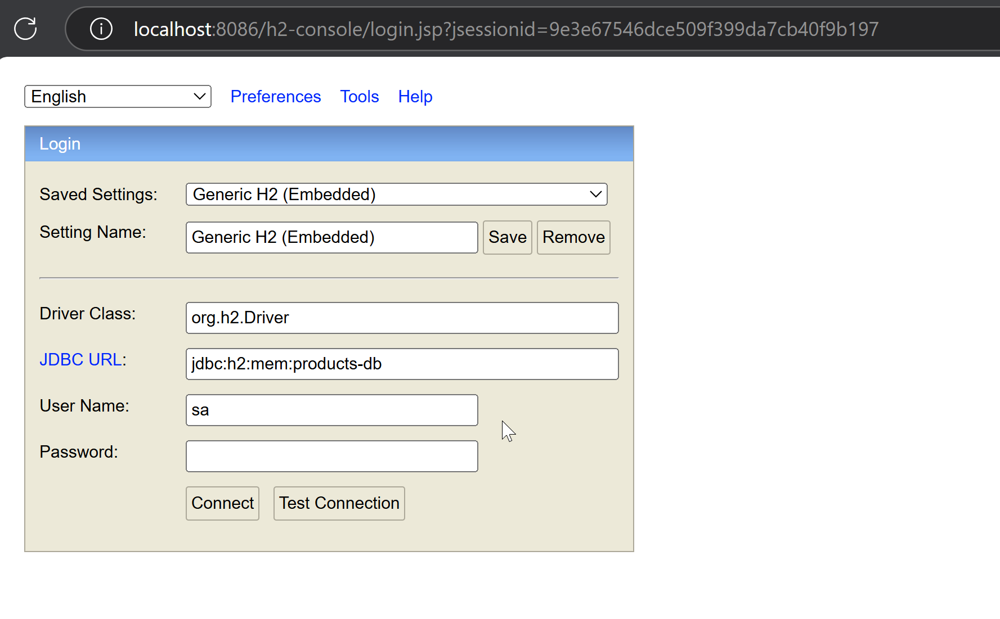
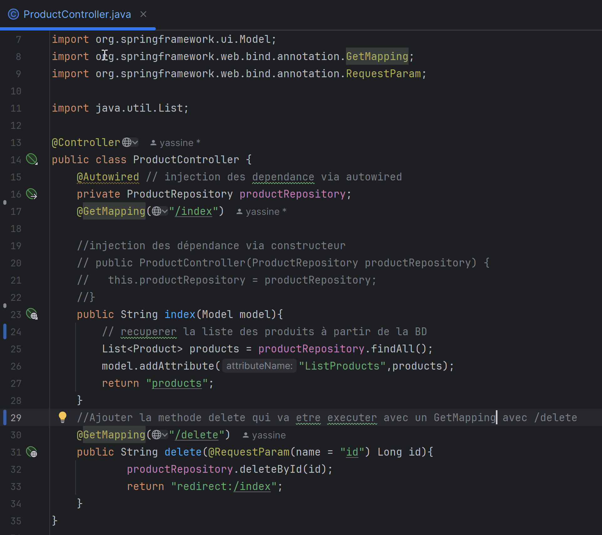
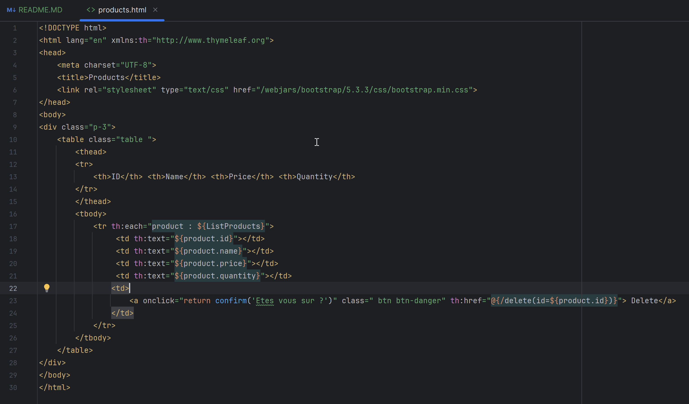
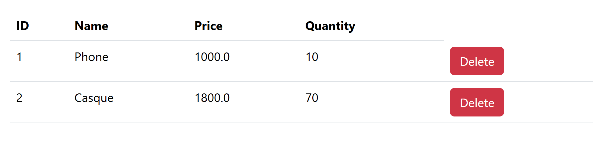

<h2>Spring MVC avec Thymeleaf</h2>

Dans cet atelier pratique, nous allons créer une petite application
de gestion de produits en utilisant Spring MVC avec une architecture orientée rendu 
HTML côté serveur. Pour cela, nous utiliserons le moteur de templates Thymeleaf/p>

<h3>- Creation des Packages </h3>

Le package entities pour les entities , repository pour la couche Dao et la package Web

 
<h3>- Creation de la classe Produit </h3>

 Pour qu'une classe soit reconnue comme une entité JPA, on ajoute l’annotation @Entity. 

<h3>- Creation de l'interface ProductRepository </h3>

Pour travailler avec Spring Data JPA, l’interface ProductRepository doit hériter de l’interface générique JpaRepository

 

<h3>- Tester L'application</h3>

Pour effectuer un test au démarrage de l’application, on utilise une méthode 
qui retourne un objet de type CommandLineRunner. Cette méthode est annotée 
avec @Bean, ce qui signifie qu’elle sera exécutée automatiquement au lancement de l’application. 
Toutes les méthodes annotées avec @Bean sont en effet appelées lors du démarrage du contexte Spring. 
Cela permet, par exemple, d’initialiser des données de test.

<h3>- Note:</h3>

Le constructeur avec paramètres n’est pas toujours pratique, notamment parce qu’il 
est facile d’oublier l’ordre des paramètres ou de se tromper . C’est pour cette raison que nous avons utilisé l’annotation @Builder dans la classe Product, fournie par Lombok, afin de générer 
automatiquement le code du builder.

Avant de pouvoir tester l'application, nous devons spécifier les informations de connexion à la base de données dans 
le fichier application.properties. 

<h3>- Ajouter les dependance nécessaire </h3>

Si le projet utilise Java 21 ou 23, il est nécessaire
d’ajouter explicitement la version de Lombok dans le fichier pom.xml. Sans cela,
Lombok risque de ne pas être reconnu correctement par le compilateur, ce qui peut entraîner des erreurs lors de la compilation ou de l’exécution.

<h3> Lancement de L'application dans le navigateur</h3>

Apres execution ,On  tape URl suivant "localhost:8086/h2-console" 

<h3>- Creer Un Controller dans le package Web </h3>
    <ul>
        <li> Déclarer le contrôleur :
Pour que la classe soit reconnue comme un contrôleur Spring MVC, il faut l’annoter avec @Controller.</li>  
    <li> Accès à la base de données :
Pour interagir avec la base de données, on déclare un objet de type ProductRepository, qui sera injecté automatiquement par Spring grâce à l’annotation @Autowired.
    </li>
    <li> Créer une méthode de traitement :
    Cette méthode retourne une vue (fichier HTML Thymeleaf, par exemple).
    On utilise l’annotation @GetMapping("/index") pour que cette méthode soit appelée lorsqu’une requête HTTP GET est envoyée vers le chemin spécifié.</li>
    </ul>

<h3>- Creer de fichier Html Product </h3>

Pour afficher la liste des produits, on commence par la récupérer depuis la base de données en utilisant la méthode findAll() du ProductRepository.
Ensuite, pour transmettre cette liste à la vue, on utilise le modèle Spring MVC. Il suffit de créer un objet de type Model dans le contrôleur 
et d’ajouter la liste au modèle avec la méthode : "model.addAttribute("listProducts", products)"

 
 
 
<h3>- Ajout de la méthode delete dans le contrôleur</h3>

Pour permettre la suppression d’un produit, on ajoute une méthode delete dans la classe ProductController.

    <ul>
     <li>Cette méthode sera appelée via une requête HTTP GET sur le chemin /delete.</li>
     <li>Elle récupère l'identifiant du produit à supprimer depuis l'URL grâce à l’annotation @RequestParam(name="id").</li>
    <li>Ensuite, elle appelle la méthode deleteById(id) du ProductRepository.</li>
   </ul>

